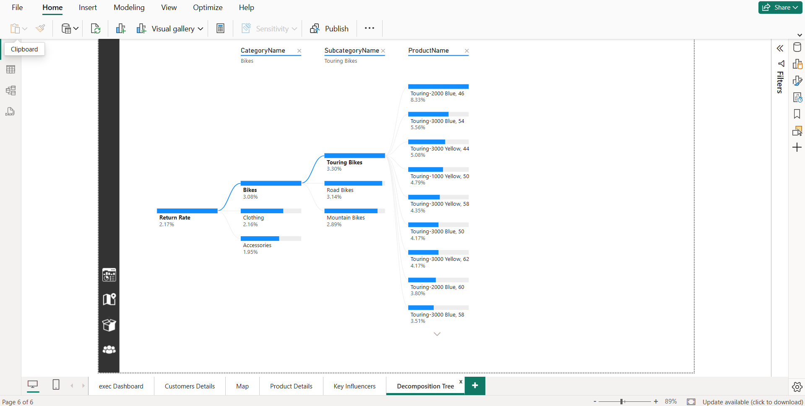

# 📊 Power-BI Business Intelligence Project

In this project, I step into the role of a **Business Intelligence Analyst** for *Maple Market*, a fictional retail company. The mission: transform raw business data into impactful reports and dashboards that drive smarter decision-making.

## 🧩 Project Objective

This end-to-end Power BI solution showcases the complete BI workflow:
- **Data Preparation**: Connecting to raw datasets and shaping them using Power Query.
- **Data Modeling**: Structuring data with relationships, calculated columns, and DAX measures.
- **Analysis**: Identifying key metrics and trends such as product performance, regional KPIs, and customer value.
- **Visualization**: Designing interactive, professional-grade dashboards for executive stakeholders.

## 🛠 Key Features

- Multiple data sources integrated and cleaned with **Power Query**
- Star schema data model using **DAX** for KPIs, time intelligence, and dynamic insights
- Interactive dashboards with:
  - Slicers and filters
  - Bookmarks and navigation panels
  - AI-powered visuals
  - **Page navigation buttons and filter clear buttons**
  - **Visual-level interactions between charts**
- Performance tuning with **Performance Analyzer** and optimization best practices

## 📌 Skills & Tools

- Power BI Desktop  
- Power Query (ETL)  
- Data Modeling (Star Schema, Relationships)  
- DAX (Measures, Time Intelligence, Filters)  
- Data Visualization (Charts, Cards, AI Visuals)  
- Performance Optimization  

---

## 📂 Data Sources

The dataset simulates real-world retail data, including sales transactions, customer demographics, product details, returns, and territories. Data was ingested from multiple CSV files and transformed using Power Query.

---

## 📊 KPIs and Metrics

Some of the key metrics created in this project include:
- Total Revenue, Cost, and Profit
- Monthly Trends and Growth
- Customer Lifetime Value
- Product Return Rate
- Regional Sales Distribution
- Revenue vs. Target Tracking

---

## 🧠 DAX Techniques Used

This project includes advanced DAX concepts such as:
- Time intelligence (e.g., YTD, previous month)
- Dynamic targets and gaps
- Customer segmentation
- Iterators and filters (e.g., CALCULATE, FILTER, SUMX)

---

## 🚀 How to Run This Project

1. Download the `.pbix` file from the repository.
2. Open it in Power BI Desktop.
3. No external connection is needed; all data is included.

---

## 🖼️ Project Screenshots

### 1. Power Query Editor
  
ETL step flow for transforming and cleaning raw data before modeling.

### 2. Data Model View
  
Star schema model showing relationships between fact and dimension tables.

### 3. Measures Table (DAX)
  
Collection of DAX measures driving all calculations and KPIs in the dashboards.

### 4. Executive Dashboard Overview
  
Displays high-level KPIs, total revenue trends, and most/least performing product categories.

### 5. Customer Insights Dashboard
  
Tracks customer count, revenue per customer, and demographics-based ordering trends.

### 6. Sales by Region (Map Visual)
  
Geographic visualization of global sales distribution using interactive map filters.

### 7. Product Performance Detail
  
**This page is a drill-through report**, accessed by right-clicking a product row in the table on the Executive Dashboard. It provides deeper insights into the selected product’s sales, profit, and return trends, along with performance vs. targets.

### 8. Key Influencer Visual
  
AI visual identifying key drivers behind customer attributes, such as homeownership.

### 9. Decomposition Tree
  
Breakdown of return rates across categories and products for root cause analysis.

## 📎 License

This project is licensed under the MIT License — see the [LICENSE](LICENSE) file for details.

---

## 🙋 About Me

I'm a data enthusiast with a Master's in Information System Engineering and a background in IT & Management. This project reflects my passion for transforming data into actionable insights through modern BI tools like Power BI.

---

## 👨‍💻 About Me

Hi, I'm an IT professional passionate about transforming raw data into actionable insights.  
This project reflects my passion for transforming data into actionable insights through modern BI tools like Power BI.

Feel free to connect with me on [LinkedIn](https://www.linkedin.com/in/aboubekrine-sedigh/) 
